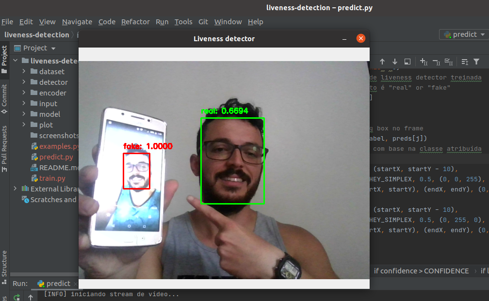
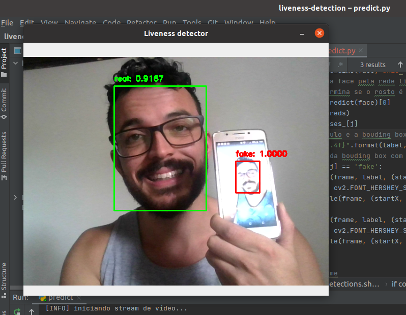
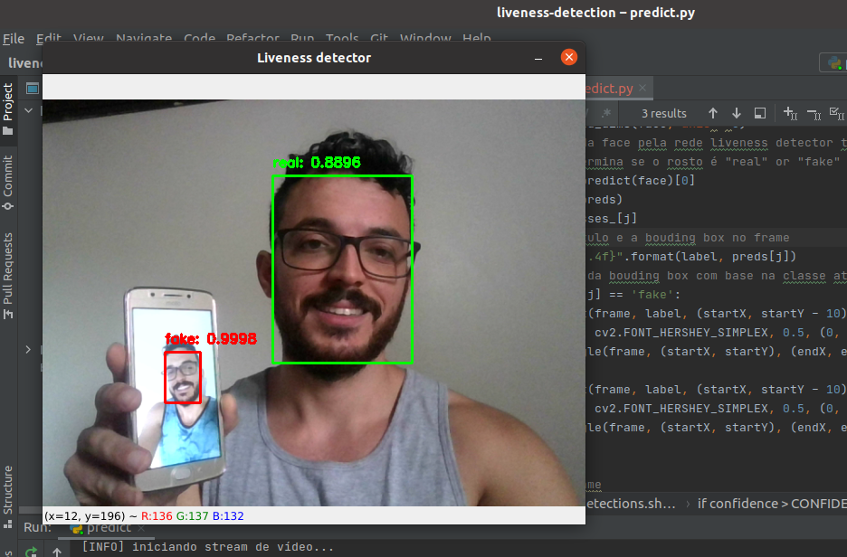

# liveness-detection
Prova de vida através de biometria facial utilizando OpenCV.

Referência:  

Adrian Rosebrock, Liveness Detection with OpenCV. PyImageSearch.       
Disponível em: https://www.pyimagesearch.com/2019/03/11/liveness-detection-with-opencv/.   
Acessado em: 26/03/2021.   

Contato:   

Alex - alex@apus.digital   
APUS Digital - https://apus.digital

Screenshots:

  

  

  